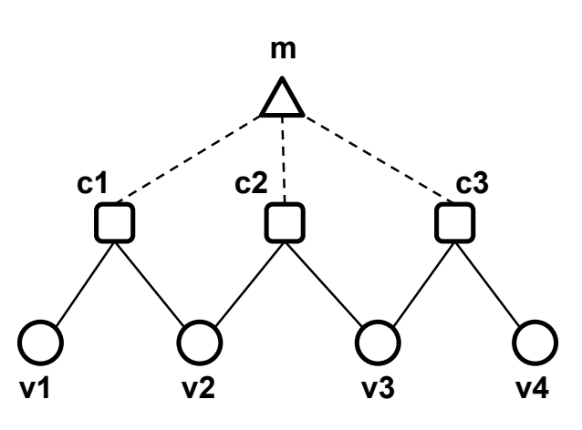
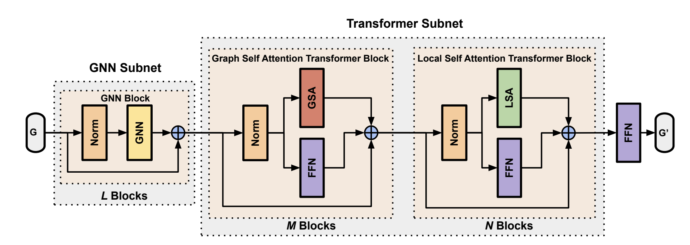

# NeuroBack: Improving CDCL SAT Solving using Graph Neural Networks
Paper: https://arxiv.org/pdf/2110.14053.pdf

## Summary
The paper trains a Graph Neural Network (GNN) to predict the polarity of variables in a SAT formula. The GNN is trained to predict backbone variables, i.e. variables that have the same polarity in all satisfying assignments. The polarity prediction of the GNN the used as a heursitic for teh Kissat Solver.

## Model Architecture

**Graph Encoding** A SAT formula is encoded into a graph containing one node for each clause $c_i$, one node for each variable $v_i$, and one dummy node that connects all clause nodes $m$. If a variable `v` appears in clause `c`, then there is an edge between the variable node and the clause node.

Edge Features: 0 for meta-edge between dummy node and clause node, 1 for edge between variable and clause node with positive polarity, -1 for edge between variable and clause node with negative polarity.

Node Features: 1 for variable nodes, -1 for clause nodes, and 0 for the dummy node. (Note: I think categorical encoding would be better here)

**GNN Architecture** The full GNN consists of GNN subnet and a Graph Transformer Subnet. GNN subnet contains $L$ `GINConv` layers with normalization and skip connections. The Graph Transformer Subnet contains GSA layers containing $L$ `GATConv` layers with normalization and skip connections, as well as a MLP in parallel. This is followed by LSA layers which divides nodes into patchs compared to the GSA layers.

**Pre-training and Fine-tuning** The model is pretrained to predict the backbone variables of a large variety of SAT formulas and fine-tuned for specific SAT benchmarks.

## Q&A
1. **What does the model Predict?**
The performs a binary polarity prediction task for each variable in the SAT formula.

2. **How does the model solve memory/computational issues compared to a transformer?**
Let $C$ be the number of clauses and $V$ be the number of variables, and $k$ be the avg number of variables per clause. The model have $C+V+1$ nodes and $C(k+1)$ edges. Each computation only have memory and computaional complexity of $O(Ck)$.
In our current Transformer representation, the SAT formula is encoded into a string containing $C(k+1)$ tokens. The model have a memory and computational complexity of $O(C^2k^2)$.